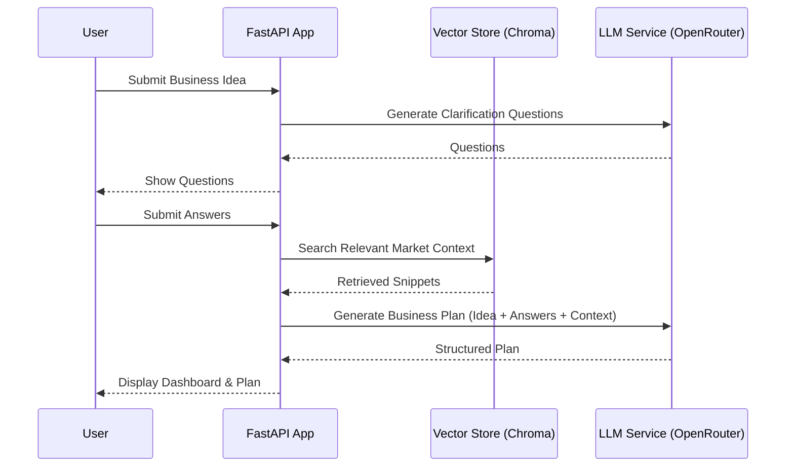

# 💼 Business Advisor AI

<p align="center">
  
</p>

<p align="center">
  <strong>Advanced RAG-powered business planning and market research assistant.</strong>
</p>

<p align="center">
  
  
  
  
  
  
  
</p>

---

## 🚀 About the Project

**Business Advisor AI** is a modular Retrieval-Augmented Generation (RAG) system designed to provide data-driven business advice and strategic planning. By grounding LLM reasoning in industry-specific data (SQL tables, PDFs, and market reports), it delivers accurate, non-hallucinated insights for new ventures.

### ✨ Key Features

-   **🔍 Multi-Source RAG**: Ingests data from SQL databases and PDFs into a Chroma vector store.
-   **🤖 Intelligent Reasoning**: Powered by Qwen (via OpenRouter/OpenAI API) for high-quality logic.
-   **📈 KPI Frameworks**: Automatically generates industry-specific metrics and measurement strategies.
-   **💬 Interactive Analysis**: Chat with the assistant to refine specific sections of your business plan.
-   **🛠️ Modular Design**: Easily swap LLM providers, embedding models, or vector databases.

---

## 🛠️ Tech Stack

- **Core Interface**  

[FastAPI](https://fastapi.tiangolo.com/) — Async API backend

- **LLM Orchestration**  

[LangChain](https://www.langchain.com/)

- **Vector Database**  

[ChromaDB](https://www.trychroma.com/)

- **Embeddings**  

[Hugging Face](https://huggingface.co/) — Sentence Transformers

- **LLM Provider**  


[OpenRouter](https://openrouter.ai/) / [OpenAI](https://openai.com/)

- **Frontend**  


HTML5, CSS3 (Glassmorphism UI), Bootstrap 5
---

## 🏗️ Architecture & Workflow

The system follows a classic RAG architecture optimized for business data ingestion and retrieval.

### Workflow Sequence



1.  **Ingestion**: `SQLRAGPipeline` reads rows from SQL, chunks text, and stores embeddings in Chroma.
2.  **Interaction**: User submits an idea; the system asks clarifying questions to narrow scope.
3.  **Retrieval**: The `RAGService` performs similarity search using HuggingFace embeddings.
4.  **Generation**: The `LLMClient` composes a prompt with retrieved context and user answers, then calls the API.

---

## 🏁 Quickstart

### 1. Installation

```bash
git clone https://github.com/your-username/business-advisor-ai.git
cd business-advisor-ai
pip install -r requirements.txt
```

### 2. Environment Setup

Create a `.env` file in the root directory:

```env
OPENROUTER_API_KEY=your_key_here
HF_TOKEN=your_token_here (optional)
```

### 3. Run the Application

```bash
uvicorn app.main:app --reload
```
Visit `http://localhost:8000` to start your business analysis.

---

## 📝 Configuration

-   **LLM Config**: Modify `app/api_llm_service.py` to change model types (default: `qwen/qwen-2-72b-instruct`).
-   **Embedding Config**: Update `app/rag.py` to use different HuggingFace models.

---

## 📄 License

Distributed under the MIT License. See `LICENSE` for more information.
---
